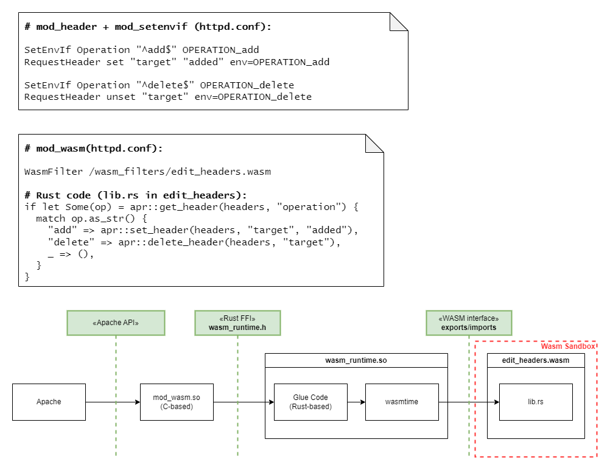

# About

Sample Wasm Reactor module which works as an Apache HTTPD module that can modify request headers.

# Architectural outline

To make this work:

 - we exposed `apr_table_get`, `apr_table_set` and `apr_table_unset` from the APR interface to the Wasm modules, running with `mod_wasm`
 - we allowed for the registration of `WasmFilter` modules which implement a `handle_request_headers(u64) -> i32` method to modify request headers

Here is a picture that summarizes the approach as compared to `mod_header` + `mod_setenvif`:

